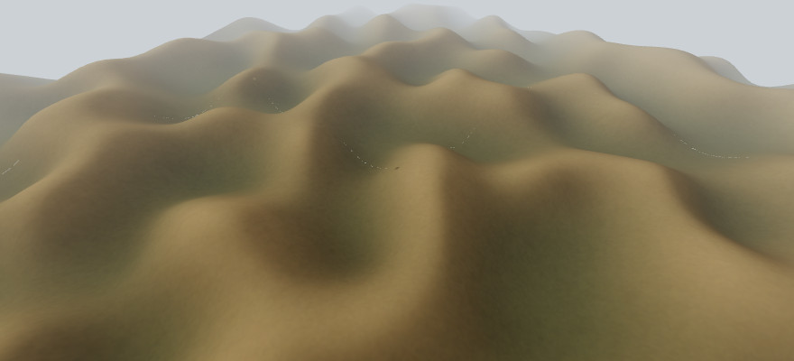
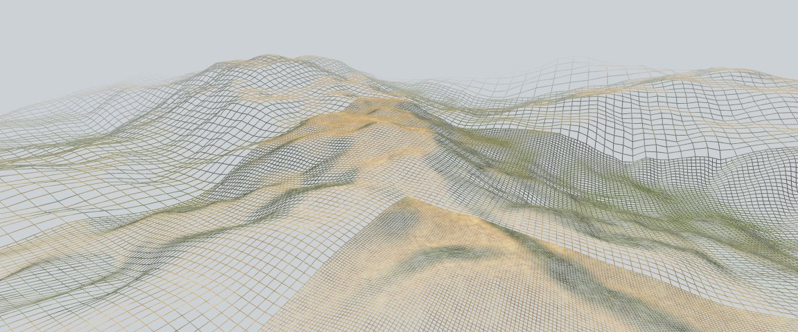

Nara
====

The terrain in the screenshots should work as an overworld for an action rpg, but is more a renderer that a videogame.

Check implemented features and future work in the [projects tab](https://github.com/baAlex/Nara/projects/). And while I always try to maintain the code in a compilable state, prepare yourself to found broken things, debug messages/graphics and incomplete functionality all over the place.

Any help is welcomed ⛰️📐️!.





Dependencies
------------
At runtime Nara requires:
 - Portaudio
 - GLFW3

For compilation:
 - Python3
 - Pkg-config
 - Ninja
 - Git

On Ubuntu you can install all dependencies with:
```
sudo apt install libglfw3-dev portaudio19-dev python3 pkg-config ninja-build git
```

And don't forget the `git submodule` steps when cloning the repo.


Compilation
-----------
To clone and compile the repository:
```
git clone https://github.com/baAlex/Nara.git
cd Nara
git submodule init
git submodule update
ninja -f posix-release.ninja
```

Optionally you can compile a debug build with:
```
ninja -f posix-debug.ninja
```


Thanks to
---------
- Erik de Castro Lopo (['libsamplerate'](https://github.com/erikd/libsamplerate) library)
- David Herberth ([GLAD](https://github.com/Dav1dde/glad) loader)
- And all contributors of [GLFW](https://github.com/glfw/glfw/graphs/contributors) and [Portaudio](http://portaudio.com/people.htmlm)

License
-------
Under MIT License.
