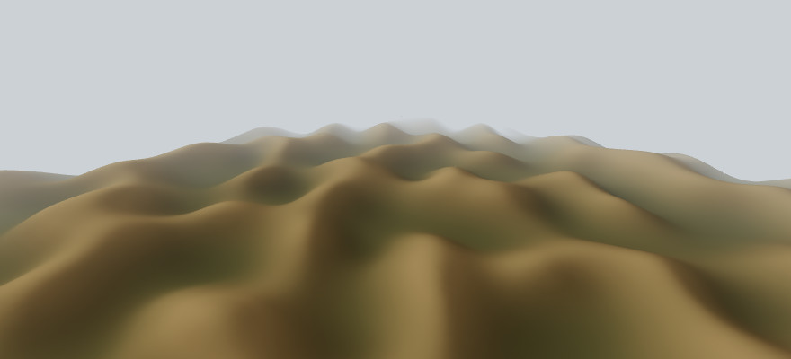
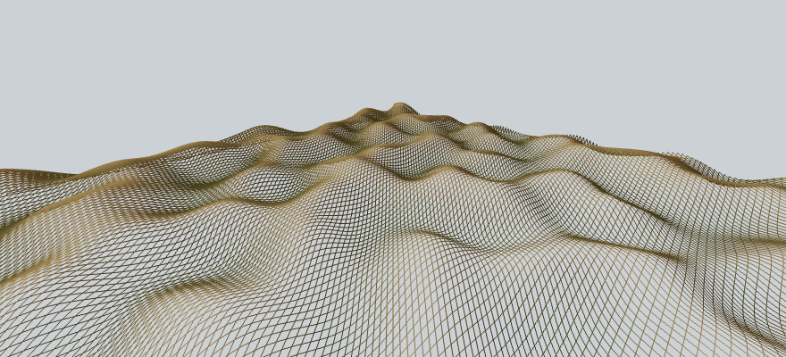

Nara
====

The terrain in the screenshots should work as an overworld for an action rpg, but at the moment is more a renderer that a videogame.




 It's not my idea to make the next Frostbite engine, using only OpenGL ES2 I want to see this game running on mobile devices (and with old-school lightmaps it still looks pretty). And yes, the screenshots delate that there are no lod mechanism on the terrain rendering, I'm working on it ⛰️📐️.


Compilation
-----------
Runtime dependencies are:
 - GLFW3
 - *An OpenGL ES2 implementation*

Compilation dependencies:
 - Ruby
 - Pkg-config
 - Ninja
 - Git

On Ubuntu (and most Posix variants) *Mesa* provide the OpenGL implementation,
so you can install all dependencies with:
```
sudo apt install libglfw3-dev libgles2-mesa-dev ruby pkg-config ninja-build git
```

To clone the repository and compile, with:
```
git clone https://github.com/baAlex/Nara.git
cd Nara
git submodule init
git submodule update
ninja
```

Optionally you can compile a debug build with:
```
ninja -f debug.ninja
```


License
-------
Under the MIT License.
