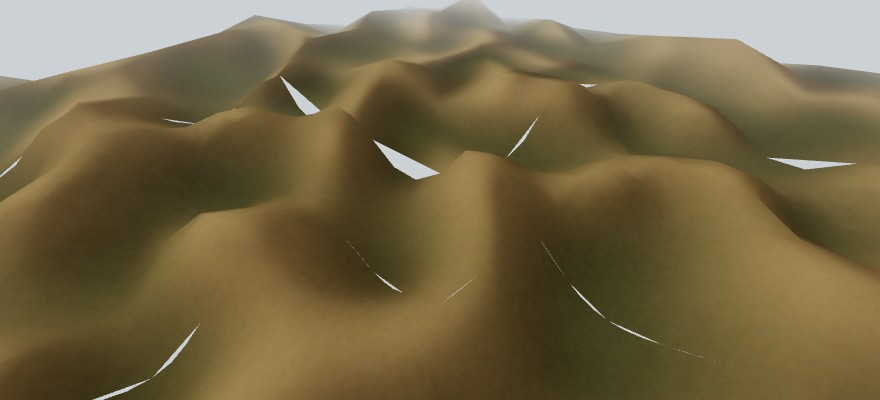
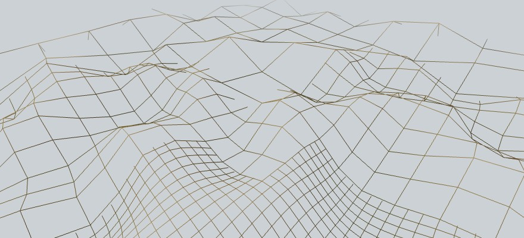

Nara
====

The terrain in the screenshots should work as an overworld for an action rpg, but at the moment is more a renderer that a videogame.

And yes, it looks terrible, even compared with old [screenshots](./documentation/screenshot-04.jpg). What happens is that the engine is not taking any measure against gaps between different levels of detail, and of course that the old approach draw everything with the same detail in a non scalable way.

If you decide to give it a try, note that also you will find poor performance. Is because I'm currently working on cleaning the code before fix these gaps, letting the rendering on a side ⛰️📐️.





Compilation
-----------
Runtime dependencies are:
 - GLFW3
 - *An OpenGL ES2 implementation*

Compilation dependencies:
 - Python3
 - Pkg-config
 - Ninja
 - Git

On Ubuntu (and most Posix variants) *Mesa* provide the OpenGL implementation, so you can install all them with:
```
sudo apt install libglfw3-dev libgles2-mesa-dev python3 pkg-config ninja-build git
```

To clone and compile the repository, with:
```
git clone https://github.com/baAlex/Nara.git
cd Nara
git submodule init
git submodule update
ninja
```

Optionally you can compile a debug build with:
```
ninja -f debug.ninja
```


License
-------
Under MIT License.
