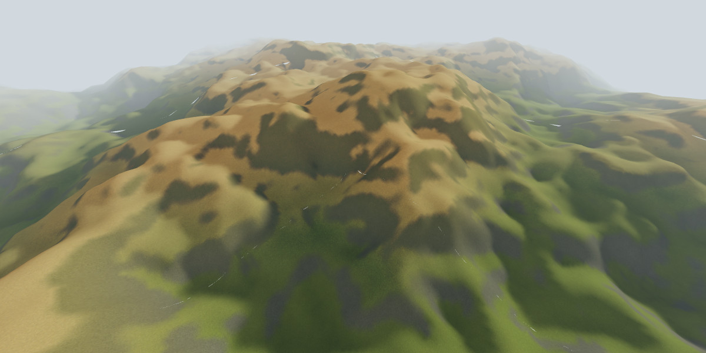
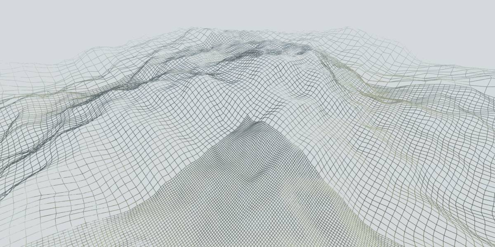

Nara
====

The terrain in the screenshots should work as an overworld for an RPG, but currently this project is more a renderer than a videogame.

Eventually Nara's goal is to recreate the experience of 90's RPGs (fixing all tedious corners), taking inspiration from the *Final Fantasy* franchise, and *Squaresoft* and *Game Arts* games.

Check implemented features and future work in [Projects](https://github.com/baAlex/Nara/projects/). And while I always try to maintain the code in a compilable state, prepare yourself to found broken things, debug messages/graphics and incomplete functionality all over the place.

Any help is welcomed ⛰️📐️... oh, and 'Nara' is a codename!.





Dependencies
------------
At runtime Nara requires:
 - Portaudio
 - GLFW3

For compilation:
 - Python3
 - Cmake

On Ubuntu you can install all dependencies with:
```
sudo apt install libglfw3-dev portaudio19-dev python3 cmake
```

And don't forget the `git submodule` steps when cloning the repo.


Compilation
-----------
To clone and compile the repository:
```
git clone https://github.com/baAlex/Nara.git
cd Nara
git submodule init
git submodule update

mkdir build
cd build
cmake ..
make
```

Optionally you can compile a debug build with:
```
cmake -DCMAKE_BUILD_TYPE=Debug ..
```


Thanks to
---------
- [0 A.D. team](https://play0ad.com/), for the textures that I borrowed
- Henrik A. Glass (['erodr'](https://github.com/henrikglass/erodr), Simulated hydraulic erosion implementation)
- Erik de Castro Lopo (['libsamplerate'](https://github.com/erikd/libsamplerate) library)
- David Herberth ([GLAD](https://github.com/Dav1dde/glad) loader)
- And all contributors of [GLFW](https://github.com/glfw/glfw/graphs/contributors) and [Portaudio](http://portaudio.com/people.htmlm)


License
-------
Under MIT License, and terms specified in the 'THIRDPARTY_NOTICES' file.
