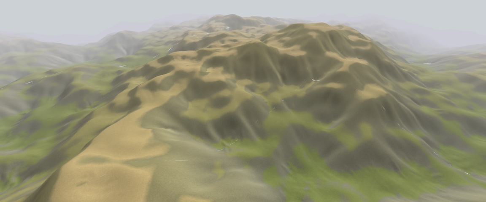
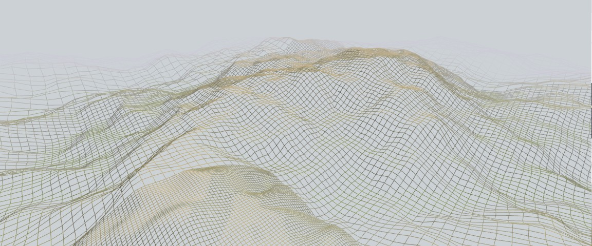

Nara
====

The terrain in the screenshots should work as an overworld for an action rpg, but is more a renderer that a videogame.

And yes, it looks terrible. What happens with these gaps is that the engine is not taking any measure against different levels of detail. But these are waves in a sea of things to do.

Check implemented features and future work in the [progress tab](https://github.com/baAlex/Nara/projects/4). Any help is welcomed, and of course make this project yours too ⛰️📐️!.





Compilation
-----------
Runtime dependencies are:
 - Portaudio
 - GLFW3
 - *An OpenGL ES2 implementation*

Compilation dependencies:
 - Python3
 - Pkg-config
 - Ninja
 - Git

On Ubuntu (and most Posix variants) *Mesa* provide the OpenGL implementation, so you can install all them with:
```
sudo apt install libglfw3-dev portaudio19-dev libgles2-mesa-dev python3 pkg-config ninja-build git
```

To clone and compile the repository:
```
git clone https://github.com/baAlex/Nara.git
cd Nara
git submodule init
git submodule update
ninja
```

Optionally you can compile a debug build with:
```
ninja -f debug.ninja
```


License
-------
Under MIT License.
